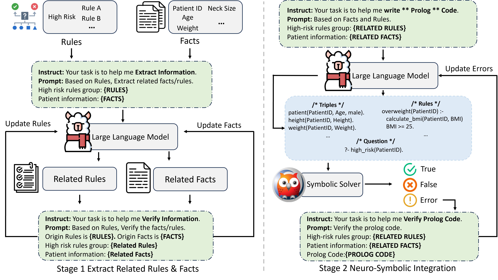

# Anonymous Submission for MICCAI 2025 Paper ID: 2399

This repository contains the anonymized materials for our submission to MICCAI 2025 (Paper ID: 2399). Below is an overview of the contents and structure of this repository. 

'''
├── data/ # Anonymized dataset
├── figures/ # Figures
├── prompts/ # Prompts used in Stage 1 and Stage 2
└── README.md # This file
'''

**The code will be made publicly available upon paper acceptance**

---

### 1. Overview
- **Framework**: The overall framework is illustrated as follows:
  
- 

- **Stages**:
  - **Stage 1**:
  - 
  - **Stage 2**:
  - 
- **Case Study**: A detailed case study is provided at the end of this document.

---

### 2. Prompts
- **Stage 1 Prompt**:

- **Stage 2 Prompt**:

---

### 3. Case Study
Below is the case study demonstrating the application of our framework:

---

This README file provides a comprehensive guide to the contents of this repository. All materials have been anonymized for double-blind review. For further details, please refer to the supplementary materials.

---
