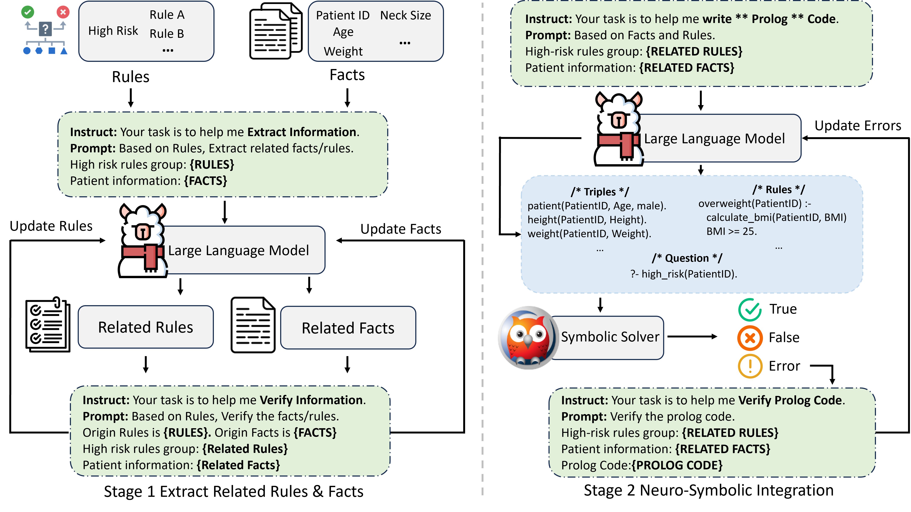

# ProCDS
This is repo of MICCAI 2025 paper 'Prolog-Driven Rule-Based Diagnostics with Large Language Models for Precise Clinical Decision Support'

```
├── data/ # Example of Anonymized Dataset
├── figures/ # Figures
├── Prompts.py # Prompts used in Stage 1 and Stage 2
├── Stage1_extracItnfo.py # Workflow of Stage 1
├── Stage2_prologGenerate.py # Workflow of Stage 2
├── Stage2_verifyCode.py # Workflow of Stage 2
├── prologInference.py # Inference Code of Prolog
└── README.md 
```

## Overview
- **Framework**: The overall framework is illustrated as follows:
  



## Features

- **LLM-Powered Information Extraction**: Leverages LLMs to understand and extract key rules and patient facts from text.
- **Automated Prolog Generation**: Translates extracted information into executable Prolog code.
- **LLM-Based Code Verification**: Employs an LLM to review and refine the generated Prolog code, improving its reliability.
- **Multi-Stage Pipeline**: A clear, step-by-step workflow from raw data to final inference.


## Dependencies

- **Python Libraries**:
  - [`vllm`](https://github.com/vllm-project/vllm): For high-throughput LLM inference. Requires a compatible GPU (e.g., NVIDIA) and CUDA toolkit.
  - `jsonlines`: For handling JSONL files.
  - [`pyswip`](https://pyswip.readthedocs.io/en/stable/get_started.html): Python-Prolog Interface
  ```bash
  pip install vllm jsonlines pyswip
  ```

- **External Software**:
  - **SWI-Prolog**: The `prologInference.py` script requires a [SWI-Prolog](https://www.swi-prolog.org/Download.html) interpreter to be installed and available in the system's PATH.
  
## How to Run

First, ensure all dependencies are installed. Then, run the scripts in sequence.

```bash
# --- Configuration ---
# Path to the local LLM model compatible with vLLM
MODEL_PATH="/path/to/your/Llama-3-8B-Chat" 
# Path to the input data
INPUT_DATA="data/patient.jsonl"

# --- Output file paths ---
EXTRACT_OUTPUT="data/data_extract.jsonl"
PROLOG_OUTPUT="data/prolog.jsonl"
PROLOG_VERIFIED_OUTPUT="data/prolog_verified.jsonl"
FINAL_RESULTS="data/results.jsonl"

# Stage 1: Extract Rules and Facts
python submit/Stage1_extractInfo.py \
    --model_path $MODEL_PATH \
    --input_path $INPUT_DATA \
    --output_path $EXTRACT_OUTPUT

# Stage 2a: Generate Prolog Code
python submit/Stage2_prologGenerate.py \
    --model_path $MODEL_PATH \
    --input $EXTRACT_OUTPUT \
    --output $PROLOG_OUTPUT

# Stage 2b: Run Prolog Inference
python submit/prologInference.py \
    --input $PROLOG_OUTPUT \
    --output $PROLOG_RESULTS

# Stage 2c: Verify Prolog Code
python submit/Stage2_verifyCode.py \
    --model_path $MODEL_PATH \
    --input $PROLOG_OUTPUT \
    --output $PROLOG_VERIFIED_OUTPUT

# Stage 2d: Run Prolog Inference
python submit/prologInference.py \
    --input $PROLOG_VERIFIED_OUTPUT \
    --output $FINAL_RESULTS
```

---

# Ackonwledgment
We extend our sincere gratitude to the following open-source projects and communities for their invaluable contributions:

- **[SWI-Prolog](https://www.swi-prolog.org/)** – The powerful Prolog engine that enabled efficient symbolic reasoning in our work.
- **[PySwip](https://github.com/yuce/pyswip)** – The Python-SWI-Prolog bridge that made seamless integration possible.
- **[vLLM](https://github.com/vllm-project/vllm)** – The high-performance LLM serving framework that accelerated our inference pipelines.

We deeply appreciate the efforts of their developers and maintainers.

